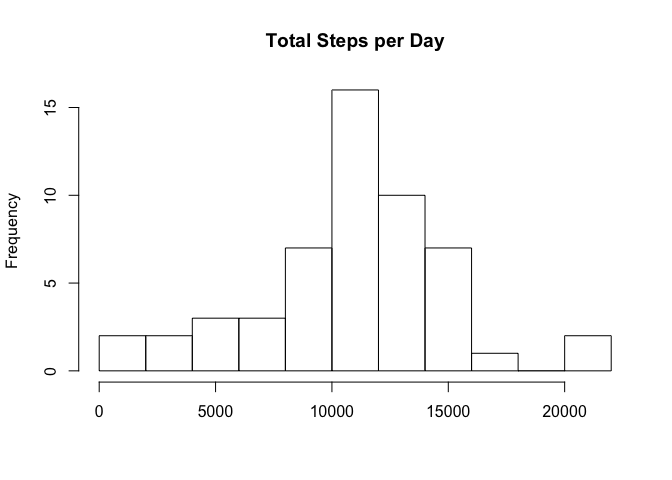
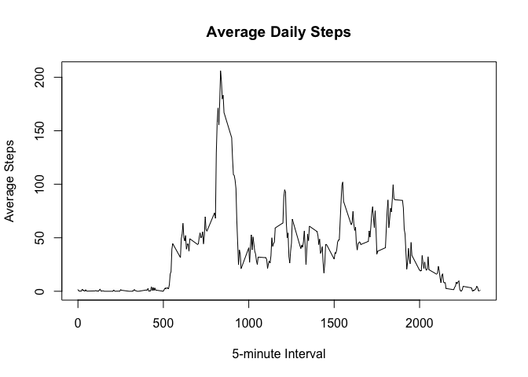
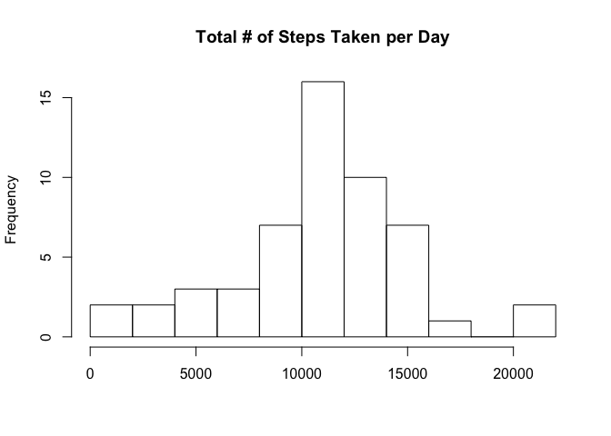
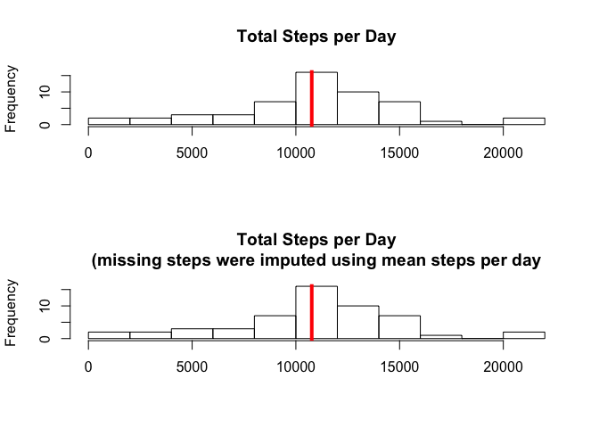
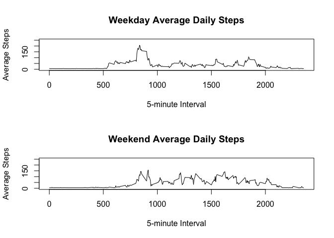

# Reproducible Research: Peer Assessment 1

# Introduction
This assignment makes use of data from a personal activity monitoring device. This device collects data at 5 minute intervals through out the day. The data consists of two months of data from an anonymous individual collected during the months of October and November, 2012 and include the number of steps taken in 5 minute intervals each day.

## Loading and preprocessing the data
The assignment data set is included in the Git repository, forked from https://github.com/rdpeng/RepData_PeerAssessment1, in the file activity.zip. I have manually unpacked that to activity.csv. Load data:

```r
setwd("~/Desktop/Data Science Coursera/Reproducible Research/assignment1")
rawdata <- read.csv(file = "activity.csv", header = T, sep = ",")
```

## What is mean total number of steps taken per day?

```r
# For this part of the assignment, ignore the missing values in the dataset.
# Note:  The default of the aggregate agrument, na.action, is to ignore missing values in the given variables.
stepcnt <- aggregate(steps ~ date, data = rawdata, sum)
```


```r
# Make a histogram of the total number of steps taken each day
hist(stepcnt$steps, breaks=10, main = "Total Steps per Day", xlab = ' ')
```

 

Calculate and report the mean and median of the total number of steps taken per day

```r
mean_steps <- mean(stepcnt$steps)
mean_steps
```

```
## [1] 10766.19
```

```r
median_steps <- median(stepcnt$steps)
median_steps
```

```
## [1] 10765
```

## What is the average daily activity pattern?

```r
stepavg <- aggregate(steps ~ interval, data = rawdata, mean)

plot (x = stepavg$interval, y = stepavg$steps, type='l', main = "Average Daily Steps", xlab = "5-minute Interval", ylab = "Average Steps")
```

 
Which 5-minute interval, on average across all the days in the dataset, contains the maximum number of steps?

```r
max_interval <- stepavg$interval[which(stepavg$steps == max(stepavg$steps))]
max_interval
```

```
## [1] 835
```

## Imputing missing values

```r
# Calculate and report the total number of missing values in the dataset (i.e. the total number of rows with NAs)
na_obs <- sum(is.na(rawdata))
na_obs
```

```
## [1] 2304
```

```r
# For missing imputations, sse the mean for that day.
data_impute_missing <- rawdata
data_impute_missing$steps[is.na(rawdata$steps)] <- mean(rawdata$steps, na.rm=T)

# Make a histogram of the total number of steps taken each day and Calculate and report the mean and median total number of steps taken per day. Do these values differ from the estimates from the first part of the assignment? What is the impact of imputing missing data on the estimates of the total daily number of steps?
stepcnt2 <- aggregate(steps ~ date, data = rawdata, sum)
hist(stepcnt2$steps, breaks=10, main = "Total # of Steps Taken per Day", xlab = ' ')
```

 

```r
mean_steps2 <- mean(stepcnt2$steps)
median_steps2 <- median(stepcnt2$steps)

par(mfrow=c(2,1))
hist(stepcnt$steps, breaks=10, main = "Total Steps per Day", xlab = ' ')
abline(v = mean(stepcnt$steps), lwd = 4, col="red")
hist(stepcnt2$steps, breaks=10, main = "Total Steps per Day\n(missing steps were imputed using mean steps per day", xlab = ' ')
abline(v = mean(stepcnt2$steps), lwd = 4, col="red")
```

 

There is little difference after performing imputations.

```r
mean_diff <- abs(mean_steps - mean_steps2)
mean_diff
```

```
## [1] 0
```

```r
median_diff <- abs(median_steps - median_steps2)
median_diff
```

```
## [1] 0
```

## Are there differences in activity patterns between weekdays and weekends?

```r
days <- data_impute_missing
wdy <- weekdays(as.Date(days$date))
days$dytype <- factor(wdy, levels <- c ('weekday', 'weekend'))
days$dytype[] <- 'weekday'
days$dytype[wdy %in% c ('Saturday', 'Sunday')] <- 'weekend'

weekday <- subset(days, dytype == "weekday") 
weekday_stepavg <- aggregate(steps ~ interval, data = weekday, mean)

weekend <- subset(days, dytype == "weekend") 
weekend_stepavg <- aggregate(steps ~ interval, data = weekend, mean)

par(mfrow=c(2,1))
plot(x = weekday_stepavg$interval, y = weekday_stepavg$steps, type='l', main="Weekday Average Daily Steps", xlab = "5-minute Interval", ylab = "Average Steps", ylim=c(0,250))

plot(x = weekend_stepavg$interval, y = weekend_stepavg$steps, type='l', main="Weekend Average Daily Steps", xlab = "5-minute Interval", ylab = "Average Steps", ylim=c(0,250))
```

 

There are differences easily noted upon examination of the two plots.
